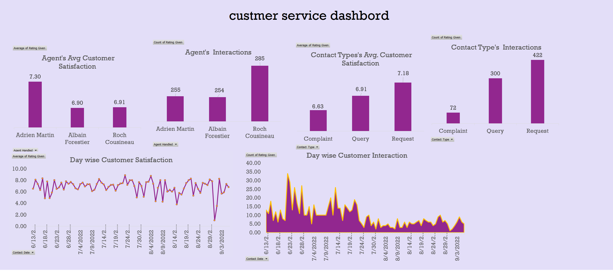

# Customer Service Dashboard Analysis

The **Customer Service Dashboard** provides insights into customer interactions, agent performance, and overall satisfaction. This report explores key trends and patterns to identify areas for improvement in customer service operations.

---

## Agent Performance Analysis

 **Adrien Martin** has the highest satisfaction rating (**7.30**), indicating strong customer engagement.

**Albin Forestier and Roch Cousineau** have slightly lower satisfaction scores (**6.90** and **6.91**).

 There is a **variance of 0.4 points**, suggesting differences in query resolution efficiency.

#### Key Observations:
- **Roch Cousineau** handled the most interactions (**285**) but does not have the highest satisfaction score.
- **Workload balancing and training improvements** may be needed.

---

## Contact Type Analysis
###  Average Customer Satisfaction

- **Complaints have the lowest satisfaction score (6.63)**, indicating a need for process improvements.
- **Requests (7.18) are well managed.**

### Total Number of Interactions

- **Requests make up 52% of total interactions.**
- **Complaints account for only 9% but have a significant impact on overall satisfaction.**

---

## Trend Analysis Over Time

### Day-Wise Customer Satisfaction
- Satisfaction fluctuates between **6.0 and 8.0**.
- Periods of sharp decline may be linked to high ticket volumes or unresolved complaints.

### Day-Wise Customer Interactions
- Interaction volume spikes in mid-June and early July, indicating a **seasonal increase**.
- Implementing **self-service options** can help manage high workloads.

---

## Key observations
### Areas of Strength

 **High customer satisfaction for requests.**  
 **Efficient handling of queries and requests.**  
 **Agents manage high interaction volumes well.**  

### Areas for Improvement
 **Complaint resolution needs enhancement.**  
 **Workload distribution is unbalanced.**  
 **Fluctuations in satisfaction scores suggest inconsistency.**  

### Actionable Recommendations
 **Improve Complaint Handling:**
- Train agents on de-escalation and resolution techniques.
- Implement a priority system for complaint resolution.
- Enhance response time and communication transparency.

 **Optimize Workload Distribution:**
- Balance interaction allocation among agents.
- Use automation tools for simple queries.

 **Analyze Satisfaction Trends:**
- Identify and address low-satisfaction periods.
- Implement customer feedback loops for real-time issue resolution.

 **Leverage Self-Service Options:**
- Develop an **FAQ section, AI chatbots, and knowledge bases**.
- Automate **common issue ticketing** to improve efficiency.

---

The customer service dashboard provides valuable insights into agent efficiency, customer satisfaction, and interaction trends. By **enhancing complaint resolution, balancing workloads, and leveraging automation**, customer satisfaction can improve while reducing agent burnout. These insights help refine service strategies and ensure a seamless customer experience.

